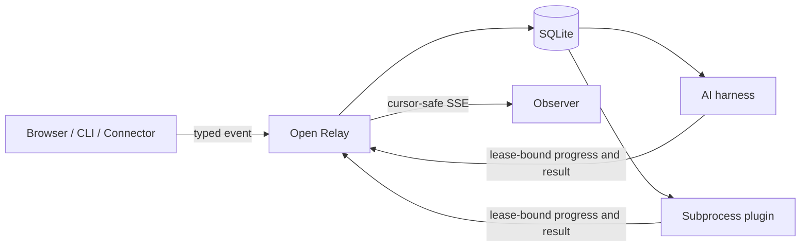

# Open Relay

A local, durable event relay for AI harnesses, subprocess plugins, and external connectors.

Open Relay keeps event behavior extensible while fixing the lifecycle around it: schema validation, idempotent acceptance, immutable definitions, leases, retries, cancellation, recovery, and observation.

> **Status:** Experimental. The architecture is implemented and extensively tested, but public APIs may change. Node 22 currently reports `node:sqlite` as experimental.

## Why

Agent integrations often combine browser actions, shell polling, ad hoc JSON, and source edits without a reliable handoff. Open Relay provides one local path for that work:



Event definitions decide **what** work means and which handler receives it. Open Relay owns **how** work is accepted, delivered, recovered, and observed.

## Features

- Versioned JSON event definitions with input and output schemas
- Content-addressed immutable definition revisions
- Producer-scoped idempotency keys
- At-least-once delivery with worker and lease fencing
- Durable retry scheduling and explicit recovery for uncertain effects
- Capability-matched AI workers with trusted context boundaries
- Bounded subprocess protocol over JSONL
- Cursor-safe Server-Sent Events backed by durable update history
- Loopback-only HTTP API with scoped credentials
- CLI and browser clients
- GitHub PR connector with recognizers for:
  - SonarQube / SonarCloud analysis
  - GitHub Copilot code review
  - Cursor Bugbot review

## Requirements

- Node.js 22.19 or newer
- npm

## Install from source

```bash
git clone https://github.com/feddericovonwernich/open-relay.git
cd open-relay
npm ci
npm run build
npm link
```

## Quick start

Open Relay loads event definitions from `events/` by default, or `.relay/events/` when that directory exists.

```bash
relay start
```

In another terminal:

```bash
relay emit ui.variant.requested \
  --version 1 \
  --idempotency-key example-1 \
  --json '{"variant":"dark"}'
```

Read an event:

```bash
relay get <event-id>
```

Cancel or inspect recovery work:

```bash
relay cancel <event-id>
relay recovery list
relay recovery resolve <event-id> --as completed --evidence '{"verified":true}'
```

See [`tests/fixtures/events/ui-variant.v1.json`](tests/fixtures/events/ui-variant.v1.json) for a complete event-definition example.

## GitHub PR connector

The connector polls GitHub locally and emits normalized PR automation completions into the running relay.

```bash
export GITHUB_TOKEN=github_pat_...
relay connect github --config .relay/connectors/github.json --once --discover
relay connect github --config .relay/connectors/github.json
```

Terminology:

- **Connector:** owns an external transport, authentication, polling, and Relay emission.
- **Recognizer:** identifies a provider-specific completion artifact.
- **Trigger:** maps a recognized completion to an Open Relay event type and version.

The built-in recognizers use these completion signals:

| Provider | Completion signal |
|---|---|
| SonarQube | Completed `SonarCloud Code Analysis` or `SonarQube Code Analysis` check with operator-pinned app identity |
| GitHub Copilot | Submitted current-head pull-request review from the configured Copilot bot identity |
| Cursor Bugbot | Completed `Cursor Bugbot` check from the Cursor GitHub App |

The connector uses read-only GitHub permissions: **Checks**, **Pull requests**, and **Metadata**. Tokens stay in authorization headers and are excluded from events and logs.

See the [GitHub connector specification](docs/superpowers/specs/2026-09-08-github-pr-connectors-design.md) for configuration, normalized payloads, identity caveats, and provider sources.

## Security model

- The relay binds to loopback.
- Producer, observer, worker, and administrator credentials are separate.
- Payload and retrieved context are untrusted data.
- The trusted reference worker runtime enforces model tool access and redacts resolved secrets.
- Subprocess plugins and arbitrary worker processes remain trusted local code; process separation is crash containment, not a sandbox.
- Consequential effects retry only with persisted downstream idempotency evidence. Ambiguous outcomes enter explicit recovery.

## Architecture

- [Architecture specification](docs/superpowers/specs/2026-09-05-open-relay-design.md)
- [GitHub connector specification](docs/superpowers/specs/2026-09-08-github-pr-connectors-design.md)
- [Architecture presentation](docs/architecture/index.html)

## Development

```bash
npm test
npm run typecheck
npm run build
```

The test suite covers concurrent acceptance, definition immutability, lease races, retries, cancellation, effect recovery, process failure modes, SSE replay races, GitHub pagination/rate limits, provider recognition, connector restart reconciliation, and real loopback integration.

## License

Apache License 2.0. See [LICENSE](LICENSE).
