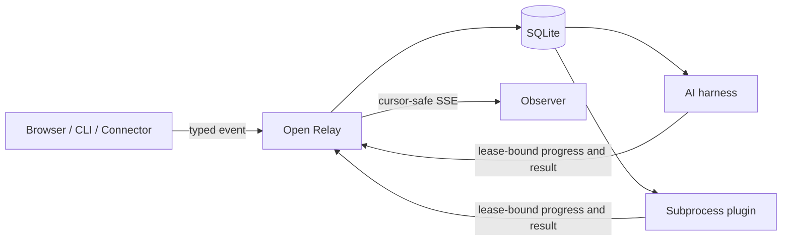

# Open Relay

A local, durable event relay for AI harnesses, subprocess plugins, and external connectors.

Open Relay keeps event behavior extensible while fixing the lifecycle around it: schema validation, idempotent acceptance, immutable definitions, leases, retries, cancellation, recovery, and observation.

> **Status:** Experimental. The architecture is implemented and extensively tested, but public APIs may change. Node 22 currently reports `node:sqlite` as experimental.

## Why

Agent integrations often combine browser actions, shell polling, ad hoc JSON, and source edits without a reliable handoff. Open Relay provides one local path for that work:



Event definitions decide **what** work means and which handler receives it. Open Relay owns **how** work is accepted, delivered, recovered, and observed.

## Features

- Versioned JSON event definitions with input and output schemas
- Content-addressed immutable definition revisions
- Producer-scoped idempotency keys
- At-least-once delivery with worker and lease fencing
- Durable retry scheduling and explicit recovery for uncertain effects
- Capability-matched AI workers with trusted context boundaries
- Bounded subprocess protocol over JSONL
- Cursor-safe Server-Sent Events backed by durable update history
- Loopback-only HTTP API with scoped credentials
- CLI and browser clients
- GitHub PR connector with recognizers for:
  - SonarQube / SonarCloud analysis
  - GitHub Copilot code review
  - Cursor Bugbot review

## Requirements

- Node.js 22.19 or newer
- npm

## Install

```bash
npm install --global github:feddericovonwernich/open-relay
relay --help
```

The GitHub installation uses the checked-in CLI build verified by CI. Open Relay is not published to the npm registry.

## Two-minute quick start

Create a project:

```bash
mkdir relay-demo
cd relay-demo
relay init
```

Start the relay in that directory:

```bash
relay start
```

In another terminal, return to the same directory and emit an event:

```bash
cd relay-demo
relay emit example.requested \
  --version 1 \
  --idempotency-key example-1 \
  --json '{"message":"hello"}'
```

Use the returned ID to read the durable event, then stop the service:

```bash
relay get <event-id>
relay stop
```

The example can remain queued until a compatible worker registers. Successful acceptance and retrieval prove the relay is installed and the generated definition is valid.

`relay init` creates `.relay/events`, `.relay/schemas`, and `.relay/handlers`. It is idempotent when generated files are unchanged and refuses to overwrite modified files. See [`examples/basic`](examples/basic) for the exact generated project.

## Agent installation

Agents should read [`AGENTS.md`](AGENTS.md), then follow the deterministic [`agent quick start`](docs/agent-quickstart.md). The required sequence is:

```text
verify Node -> install from GitHub -> initialize target repository
-> inspect generated files -> start -> emit -> get -> stop -> report evidence
```

## GitHub PR connector

Initialize Open Relay for a repository:

```bash
cd /path/to/target-repository
relay init --github owner/repository
relay start
```

In another terminal, provide a read-only GitHub token and discover provider identities:

```bash
cd /path/to/target-repository
export GITHUB_TOKEN=github_pat_...
relay connect github --config .relay/connectors/github.json --once --discover
```

The generated configuration pins the documented Copilot and Cursor Bugbot identities. SonarQube identity varies by installation, so it is intentionally unpinned for discovery. Add the observed Sonar app ID or slug to `.relay/connectors/github.json` before continuous polling:

```bash
relay connect github --config .relay/connectors/github.json
```

Terminology:

- **Connector:** owns an external transport, authentication, polling, and Relay emission.
- **Recognizer:** identifies a provider-specific completion artifact.
- **Trigger:** maps a recognized completion to an Open Relay event type and version.

| Provider | Completion signal |
|---|---|
| SonarQube | Completed `SonarCloud Code Analysis` or `SonarQube Code Analysis` check with operator-pinned app identity |
| GitHub Copilot | Submitted current-head pull-request review from the configured Copilot bot identity |
| Cursor Bugbot | Completed `Cursor Bugbot` check from the Cursor GitHub App |

The connector requires read-only **Checks**, **Pull requests**, and **Metadata** permissions. Tokens stay in authorization headers and are excluded from configuration, events, and logs.

See [`examples/github-pr-automation`](examples/github-pr-automation) and the [GitHub connector specification](docs/superpowers/specs/2026-09-08-github-pr-connectors-design.md).

## Security model

- The relay binds to loopback.
- Producer, observer, worker, and administrator credentials are separate.
- Payload and retrieved context are untrusted data.
- The trusted reference worker runtime enforces model tool access and redacts resolved secrets.
- Subprocess plugins and arbitrary worker processes remain trusted local code; process separation is crash containment, not a sandbox.
- Consequential effects retry only with persisted downstream idempotency evidence. Ambiguous outcomes enter explicit recovery.

## Architecture

- [Architecture specification](docs/superpowers/specs/2026-09-05-open-relay-design.md)
- [GitHub connector specification](docs/superpowers/specs/2026-09-08-github-pr-connectors-design.md)
- [Architecture presentation](docs/architecture/index.html)

## Development

```bash
git clone https://github.com/feddericovonwernich/open-relay.git
cd open-relay
npm ci
npm test
npm run typecheck
npm run build
npm run test:onboarding
```

The test suite covers concurrent acceptance, definition immutability, lease races, retries, cancellation, effect recovery, process failure modes, SSE replay races, GitHub pagination/rate limits, provider recognition, connector restart reconciliation, and real loopback integration.

## License

Apache License 2.0. See [LICENSE](LICENSE).
