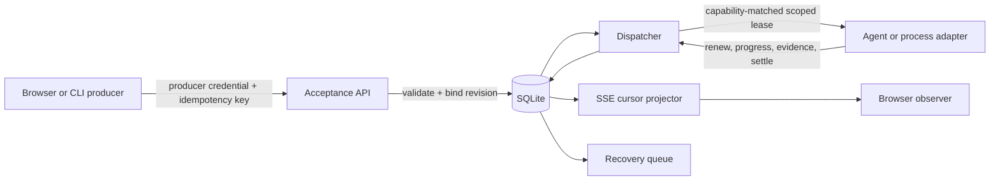
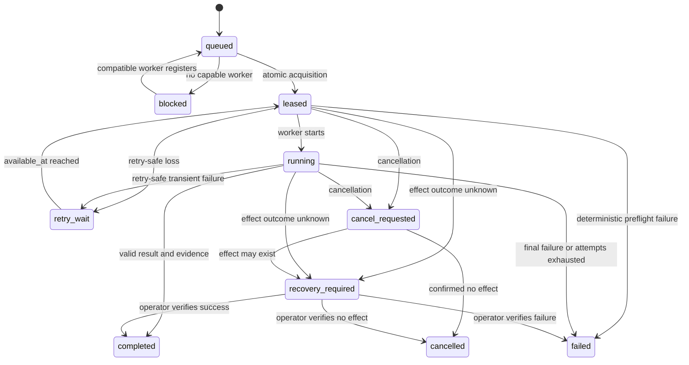

# Open Relay Architecture Design

**Status:** Reviewed revision candidate  
**Working name:** Open Relay; product name remains undecided.  
**Primary artifact:** `index.html`

## Goal

Build a local TypeScript and Node event relay that accepts open-ended, versioned event definitions from browser and CLI producers, then delivers each event to exactly one configured AI-harness or subprocess adapter under an at-least-once execution contract.

The relay owns acceptance identity, immutable definitions, durable state, leases, retries, cancellation, recovery, authorization, and observation. Extensions own event meaning and handler behavior but cannot redefine delivery correctness.

## Non-goals

- Remote or multi-host workers.
- Multi-tenant deployment.
- Topic fan-out or multiple subscribers per event occurrence.
- Workflow DAGs or event choreography.
- Exactly-once external effects.
- Cross-event ordering in the initial release.
- Loading third-party plugin code into the relay process.
- Automatic semantic retrieval or a general RAG subsystem.

## System invariants

1. **Acceptance identity:** one `(producerId, idempotencyKey)` pair identifies one durable event for the lifetime of that event record.
2. **Immutable meaning:** an accepted event references one content-addressed definition revision. Registry reload cannot alter queued work.
3. **Atomic history:** every canonical state mutation and its ordered `updates` record commit or roll back in the same SQLite transaction.
4. **Scoped authority:** only the worker identity holding the current lease may renew, report progress, or settle that delivery.
5. **Honest retries:** execution may repeat; an unknown external effect retries only with persisted proof of a downstream idempotency boundary, otherwise it enters recovery.
6. **Reference-runtime trust:** the shipped worker treats payload and retrieved context as untrusted data; neither may expand its system policy, tools, secrets, or capabilities. Arbitrary worker processes remain trusted local code.
7. **Durable observation:** SSE notifications only wake readers. Correctness comes from querying ordered update rows after the reader’s cursor.
8. **No implicit order:** `correlationId` groups events for observation only and grants no execution ordering.

## Runtime topology



One Node process owns the HTTP server, registry, SQLite connection, dispatcher, process children, and SSE projectors. Agent workers are external harness processes connected through authenticated long-poll HTTP.

## Components

### Event registry

Loads `.relay/events/*.json`. It resolves and validates every referenced schema and instruction file, canonicalizes the resolved definition, computes a SHA-256 digest, and stores the immutable definition in `definition_revisions`.

A registry key is `(type, version)`. Reload behavior:

- a new key is accepted;
- an unchanged key with the same digest is reused;
- an existing key with a different digest is rejected and requires a version increment;
- one invalid definition rejects the entire candidate registry, leaving the last valid registry active;
- historical revisions remain readable while referenced by an event.

All referenced paths resolve beneath the project root. Symlink escapes and absolute paths are rejected.

### Acceptance API

Authenticates a producer credential and requires an `Idempotency-Key` header. It resolves the active definition revision, validates payload size and JSON Schema, and atomically inserts:

- the event row;
- its immutable definition digest;
- the first `queued` update.

A uniqueness conflict on `(producer_id, idempotency_key)` returns the existing event if its type, version, and payload digest match. A reused key with different content returns `409 idempotency_conflict`.

No automatic idempotency-key expiry exists initially. Explicit event garbage collection removes the event and its key together; until then a replay remains idempotent.

### Durable store

Uses `node:sqlite` with WAL mode, foreign keys enabled, and a short busy timeout. The relay serializes write transactions through one in-process mutation lane. Read-only status and replay queries use separate reads and never hold the mutation lane while streaming. A live expiry reaper wakes on the nearest lease deadline and transactionally converts expired work to `retry_wait` or `recovery_required`; startup recovery invokes the same store operation rather than a second algorithm.

### Dispatcher

The dispatcher owns two acquisition paths over the same store transaction:

- external agent workers long-poll with an authenticated registration;
- an internal process loop acquires only `handler.kind = "process"` definitions and immediately hands them to `ProcessAdapter`.

The store exposes separate `acquireAgent(worker, now)` and `acquireProcess(processWorker, now)` methods. The external polling route can call only `acquireAgent`; the internal loop can call only `acquireProcess`. Both share the same private transaction implementation.

Both select the oldest eligible event where state is `queued`, or state is `retry_wait` and `available_at <= now`; no cancellation is pending; the worker permits the exact definition; handler kind, tools, structured-output support, context budget, and concurrency all match. Agent acquisition counts active `leased`, `running`, and `cancel_requested` rows for that worker inside the same transaction and refuses to exceed `maxConcurrent`.

`allowedDefinitions` accepts only `*`, an exact `type@version`, or a namespace prefix ending in `.*`. No other glob syntax exists.

Acquisition uses `BEGIN IMMEDIATE`, updates the event, inserts a `leased` update, and commits before delivery. A lease contains `workerId`, random `leaseId`, attempt, expiry, and hard execution deadline. The process loop uses the reserved worker identity `relay:process` and its own configured concurrency limit.

### Agent adapter

A harness is trusted local code, like an executable plugin. Registration and tool declarations prevent accidental privilege mixing; they do not sandbox a malicious worker process. The project ships a reference `TrustedWorkerRuntime<ModelAdapter, ToolAdapter>` that owns the immutable system policy, context assembly, tool dispatch, secret-handle resolution, and result validation. Agent integrations must use that runtime or provide an equivalent trusted enforcement layer.

Within the trusted runtime, delivery context is assembled in this precedence order:

1. harness system policy;
2. immutable definition instructions;
3. retrieved context, provenance-tagged and marked untrusted;
4. event payload, marked untrusted;
5. model output, treated as untrusted until validation.

Tool allowlists are enforced by the trusted runtime before invoking a `ToolAdapter`, outside the prompt. A runtime that cannot enforce a tool must not advertise that capability. Secret values are resolved from approved handles only inside tool execution. Before a tool result returns to the model, terminal validation, progress, or logs, the runtime recursively redacts every resolved secret value from strings and structured data. The relay does not claim it can constrain arbitrary code already running as the local user.

### Process adapter

During registry loading, a process command must resolve to a real executable beneath project root; absolute paths and symlink escapes are rejected. The resolved path is carried by the immutable revision. The relay leases work before calling `spawn(resolvedCommand, args, { shell: false })`. One immutable delivery JSON line is written to stdin, then stdin closes. Stdout accepts bounded JSONL protocol messages:

- `started`
- `renew`
- `progress`
- `effect_started`
- `effect_confirmed`
- `complete`
- `fail`
- `cancelled`

Malformed JSONL, line or total-output overflow, duplicate terminal messages, cancellation, and timeout all stop further protocol input and trigger the same termination ladder: `SIGTERM`, grace period, then `SIGKILL`. The resulting event transition still follows immutable effect evidence and retry policy. Process exit without a terminal message is classified immediately by relay policy rather than waiting silently for lease expiry.

Subprocess isolation is crash containment, not a security sandbox. Installing an executable plugin grants local-code trust.

### SSE projector

Maintains a per-connection sequence cursor. The in-memory notifier carries no state; it only wakes the projector to query SQLite.

Reconnect algorithm:

1. register the wake buffer;
2. call `snapshotAtHighWater(eventId?)`, which reads canonical state and high-water mark `H` in one SQLite read transaction;
3. with a retained cursor, emit updates in `(cursor, H]` and advance the cursor per row; without one, emit that transaction’s canonical snapshot tagged `H` and set the cursor to `H`;
4. repeatedly query `updates.sequence > cursor`, emit in order, advance the cursor, and deduplicate by sequence until caught up;
5. wait for notifier or heartbeat and repeat the query.

A missed notification adds latency but cannot lose a durable update.

## Public contracts

### Event definition

```ts
type HandlerKind = "agent" | "process";
type EffectPolicy = "retry-safe" | "idempotency-required" | "manual-recovery";

interface EventDefinition {
  type: string;
  version: number;
  inputSchema: string;
  outputSchema: string;
  effectPolicy: EffectPolicy;
  timeoutMs: number;
  hardDeadlineMs: number;
  retry: {
    maxAttempts: number;
    backoffMs: number[];
    retryableCodes: string[];
  };
  requires: {
    tools: string[];
    structuredOutput: boolean;
    minContextTokens: number;
    maxInputTokens: number;
    maxOutputTokens: number;
    maxPayloadBytes: number;
  };
  handler:
    | { kind: "agent"; instructions: string }
    | { kind: "process"; command: string; args: string[]; env: string[] };
}
```

The digest covers the canonical definition plus the bytes of referenced input schema, output schema, and agent instructions.

### Event envelope

```ts
interface EventEnvelope {
  id: string;
  producerId: string;
  idempotencyKey: string;
  type: string;
  version: number;
  definitionRevision: string;
  payload: unknown;
  payloadDigest: string;
  emittedAt: string;
  correlationId?: string;
}
```

### Delivery

```ts
interface Delivery {
  event: EventEnvelope;
  attempt: number;
  workerId: string;
  leaseId: string;
  leaseExpiresAt: string;
  hardDeadlineAt: string;
}
```

### Worker registration

```ts
interface WorkerCapabilities {
  workerId: string;
  allowedDefinitions: string[];
  tools: string[];
  structuredOutput: boolean;
  contextTokens: number;
  systemReserveTokens: number;
  maxConcurrent: number;
}
```

Matching is capability-based, not model-name-based. Definitions express required behavior; worker implementation remains replaceable.

Internal process acquisition uses:

```ts
interface ProcessWorker {
  workerId: "relay:process";
  maxConcurrent: number;
}
```

It has no bearer credential and is never accepted from HTTP input.

External worker registration is agent-only. `POST /v1/agent/poll` always enforces `handler.kind === "agent"` regardless of advertised data. Process definitions are reserved for the internal `relay:process` acquisition path and never enter the external poll queue.

## HTTP API

All endpoints bind to loopback. Tokens are opaque random bearer values held in memory and issued from the admin credential. Relay restart invalidates them; clients re-register.

| Endpoint | Scope | Behavior |
|---|---|---|
| `POST /v1/events` | producer | Require idempotency key; validate and accept an event. |
| `GET /v1/events/:id` | observer | Read canonical state, result, or recovery reason. |
| `POST /v1/events/:id/cancel` | producer/admin | Persist `cancel_requested` and signal the current worker. |
| `GET /v1/stream` | observer | Snapshot/replay updates through a durable cursor. |
| `POST /v1/workers/register` | admin | Register capabilities and issue a worker credential. |
| `POST /v1/agent/poll` | worker | Long-poll for one compatible agent delivery. |
| `POST /v1/deliveries/:leaseId/start` | worker | Move `leased` to `running` and journal it. |
| `POST /v1/deliveries/:leaseId/renew` | worker | Extend the lease up to the hard deadline. |
| `POST /v1/deliveries/:leaseId/progress` | worker | Append bounded progress after worker/lease verification. |
| `GET /v1/deliveries/:leaseId/control` | worker | Long-poll for `cancel_requested` while execution is active. |
| `POST /v1/deliveries/:leaseId/cancelled` | worker | Acknowledge cancellation with effect evidence. |
| `POST /v1/deliveries/:leaseId/complete` | worker | Validate result and effect evidence; settle atomically. |
| `POST /v1/deliveries/:leaseId/fail` | worker | Submit structured failure evidence; relay chooses retry or terminal state. |
| `POST /v1/recovery/:eventId/resolve` | admin | Resolve `recovery_required` as completed, failed, or cancelled with evidence. |
| `POST /v1/admin/reload` | admin | Atomically activate a fully valid registry. |

Producer, observer, worker, and admin scopes are distinct. Worker settlement verifies both credential-bound `workerId` and current `leaseId`.

## Data model

### `definition_revisions`

```text
digest TEXT PRIMARY KEY
type TEXT NOT NULL
version INTEGER NOT NULL
definition_json TEXT NOT NULL
input_schema_json TEXT NOT NULL
output_schema_json TEXT NOT NULL
instructions_text TEXT
created_at INTEGER NOT NULL
UNIQUE(type, version)
```

The store reconstructs a complete `DefinitionRevision` from this row and recompiles its schemas with Ajv. Delivery and settlement never depend on the active in-memory registry retaining an old key.

### `events`

```text
id TEXT PRIMARY KEY
producer_id TEXT NOT NULL
idempotency_key TEXT NOT NULL
type TEXT NOT NULL
version INTEGER NOT NULL
definition_revision TEXT NOT NULL REFERENCES definition_revisions(digest)
payload_json TEXT NOT NULL
payload_digest TEXT NOT NULL
correlation_id TEXT
state TEXT NOT NULL
attempt INTEGER NOT NULL DEFAULT 0
max_attempts INTEGER NOT NULL
available_at INTEGER NOT NULL
worker_id TEXT
lease_id TEXT
lease_expires_at INTEGER
hard_deadline_at INTEGER
cancel_requested_at INTEGER
effect_policy TEXT NOT NULL
recovery_reason TEXT
result_json TEXT
error_json TEXT
created_at INTEGER NOT NULL
updated_at INTEGER NOT NULL
UNIQUE(producer_id, idempotency_key)
```

### `updates`

```text
sequence INTEGER PRIMARY KEY AUTOINCREMENT
event_id TEXT NOT NULL REFERENCES events(id) ON DELETE CASCADE
kind TEXT NOT NULL
attempt INTEGER
worker_id TEXT
lease_id TEXT
data_json TEXT NOT NULL
created_at INTEGER NOT NULL
```

### `effect_intents`

```text
event_id TEXT NOT NULL REFERENCES events(id) ON DELETE CASCADE
effect_key TEXT NOT NULL
status TEXT NOT NULL
idempotency_boundary_confirmed INTEGER NOT NULL DEFAULT 0
external_ref TEXT
updated_at INTEGER NOT NULL
PRIMARY KEY(event_id, effect_key)
```

Indexes:

```sql
CREATE INDEX events_queue
  ON events(state, available_at, lease_expires_at, created_at);
CREATE INDEX updates_replay
  ON updates(event_id, sequence);
```

## Event state machine



`blocked` does not consume an attempt. A lease attempt increments only after a compatible worker is chosen.

## Transaction boundaries

### Acceptance

One transaction:

1. find `(producerId, idempotencyKey)`;
2. return existing event on exact payload/type/version match;
3. reject conflicting reuse;
4. insert immutable definition revision if absent;
5. insert `events` row;
6. insert `updates(kind='queued')`;
7. commit, then return `202`.

### Acquisition

One `BEGIN IMMEDIATE` transaction:

1. select oldest eligible event compatible with the worker;
2. set state, attempt, worker, lease, expiry, and hard deadline;
3. insert `updates(kind='leased')` with the same authority fields;
4. commit, then return the delivery.

### Renewal and progress

Verify credential-bound worker, current lease, state, lease expiry, and hard deadline. Renewal mutates the event and appends `lease_renewed` in one transaction. Progress appends a bounded update and does not extend a lease implicitly.

Effect intent and confirmation follow the same rule: each `effect_intents` mutation and its `effect_started` or `effect_confirmed` update append in one transaction. A forced failure of either write rolls back both.

### Settlement

Verify worker and lease first. Then validate output and effect evidence. The state mutation and terminal update share one transaction. A stale or foreign settlement returns `409 stale_delivery` without mutation.

### Retry scheduling

Workers return an error code and evidence; they do not choose retryability. The relay compares the code to immutable definition policy and checks effect state. Retry-safe work becomes `retry_wait`. An `idempotency-required` effect also becomes `retry_wait` when its persisted intent proves the downstream idempotency boundary accepted the deterministic effect key. Manual-recovery effects and unkeyed or unproven consequential effects become `recovery_required`.

### Cancellation

Cancellation first persists `cancel_requested` and appends its update. Process adapters receive OS signals. The trusted agent runtime concurrently holds an authenticated control long-poll for its worker-and-lease pair; `cancel_requested` aborts model and tool adapters through an `AbortSignal`, then the runtime posts `cancelled` with effect evidence. If no effect occurred, settle `cancelled`; if the result is ambiguous, enter `recovery_required`.

## Effect safety

Definitions choose:

- `retry-safe`: no durable external effect; automatic retry is allowed by retry policy;
- `idempotency-required`: automatic retry is allowed only when a deterministic effect key is stored and the effect intent records that the downstream system enforces that key;
- `manual-recovery`: any ambiguous external outcome enters `recovery_required`.

Authenticated event emission is the only effect authorization in the initial release. A separate pre-effect approval workflow is deliberately excluded until a real event requires it.

The relay does not claim exactly-once effects.

## AI context and token handling

The immutable definition declares hard maxima. Acceptance rejects payload bytes above `maxPayloadBytes`. Capability matching ensures the worker context window can accommodate `maxInputTokens + maxOutputTokens` plus its registered system reserve.

The harness context assembler uses the active model tokenizer and stops retrieval at `maxInputTokens`. Every retrieved segment records source, byte count, token count, and trust classification. If fixed instructions plus payload exceed the budget, the worker returns deterministic `CONTEXT_BUDGET_EXCEEDED`; the relay marks the event failed without retry.

No payload or retrieved document can request additional tools, secrets, or model capability. Those permissions come only from immutable system policy and definition requirements.

## Retry, timing, and recovery defaults

- Lease duration comes from the immutable definition timeout.
- Renewal is explicit and may not exceed `hardDeadlineAt`.
- The live expiry reaper schedules its next wake from the nearest lease deadline and uses the same transactional `expireLeases(now)` operation as startup recovery.
- Backoff uses the attempt-indexed `backoffMs` entry; the last entry repeats if attempts exceed the array length.
- `maxAttempts` includes the current attempt.
- Relay restart leaves unexpired leases fenced; the reaper handles them when they expire.
- On expiry, retry-safe work schedules `retry_wait`. Idempotency-required work also retries when its persisted intent confirms the downstream idempotency boundary. Manual-recovery, unkeyed, or unproven consequential work enters `recovery_required`.
- Recovery resolution requires an admin credential and stores evidence in both the event result/error and update journal.

## Ordering

The initial system offers no ordering guarantee across event IDs, including events with the same `correlationId`. Queue selection is oldest-eligible only. A future `orderingKey` may enforce one active lease per key after a concrete use case requires serialization.

## Security boundaries

- Listen only on `127.0.0.1` and `::1` when explicitly enabled.
- Use separate opaque credentials for producer, observer, worker, and admin scopes.
- Restrict browser CORS to configured origins; never return `Access-Control-Allow-Origin: *` with credentials.
- Store the admin bootstrap token in a mode-`0600` runtime file and remove it on clean shutdown.
- Keep bearer tokens out of logs and error bodies.
- Resolve every definition, schema, instruction, command, and working-directory path beneath project root.
- Spawn process plugins without a shell and with an allow-listed environment.
- Bound request bodies, payloads, progress messages, context, stdout, stderr, results, and update history entries.
- Treat executable plugins as trusted local code; do not market subprocesses as a sandbox.
- Treat agent workers as trusted local code. The reference worker runtime constrains model tool use, but the relay cannot sandbox arbitrary code running under the user account.

## Operability

The CLI exposes:

```text
relay start
relay stop
relay emit <type> --version <n> --idempotency-key <key> --json <payload>
relay get <event-id>
relay cancel <event-id>
relay recovery list
relay recovery resolve <event-id> --as completed|failed|cancelled --evidence <json>
relay workers
relay reload
relay agent poll <worker-id> [--definitions <csv>] [--tools <csv>] [--structured-output] [--context-tokens <n>] [--system-reserve <n>] [--timeout <ms>]
relay agent reply <lease-id> <action> [--json <object>]
```

Status output includes active definition digest, state, attempt, worker, lease expiry, available-at time, effect state, recovery reason, and last update sequence. Logs are structured JSON and always include `eventId`, `definitionRevision`, `attempt`, and `workerId` when available.

## Verification strategy

The implementation must leave runnable checks for:

- concurrent lost-`202` replays creating exactly one event, plus conflicting idempotency-key reuse;
- registry reload with a queued old revision after its active key is removed, reconstructed from persisted schema and instruction bytes;
- atomic rollback of event, update, effect-intent, and effect-confirmation mutations;
- two workers racing for one event, including renewal racing expiry and reacquisition;
- every capability constraint: allowed definition, handler kind, tools, structured output, context window, and max concurrency;
- live lease expiry before and after relay restart with a controlled clock;
- relay-owned retry scheduling without immediate attempt exhaustion;
- cancellation before intent, after intent, after external call, and after confirmation but before settlement;
- retry-safe, idempotency-required, and manual-recovery effect policies;
- all three admin recovery resolutions and rejection of non-admin resolution;
- payload and retrieved-context prompt injection failing to expand tools in the real reference worker runtime;
- agent cancellation delivered through the real control long-poll and propagated to model/tool abort signals;
- a tool returning a resolved secret value being redacted before model context, terminal output, progress, or logs;
- an external poller advertising process support still being unable to receive process definitions;
- idempotency-required expiry retrying only with persisted downstream-boundary evidence;
- context-budget deterministic failure;
- process event acceptance through the process dispatch loop to terminal state;
- process crash before and after effect intent, oversized output, malformed JSONL followed by a hanging child, timeout, and kill escalation;
- fresh and retained SSE reconnect with a commit between snapshot/high-water capture and tailing;
- relay restart with queued, leased, retry-waiting, cancel-requested, cancelled, and recovery-required events;
- explicit absence of cross-event ordering.

The milestone smoke test emits one consequential event, kills the worker after recording effect intent, restarts the relay, and verifies that the event enters `recovery_required` rather than executing the effect again.
