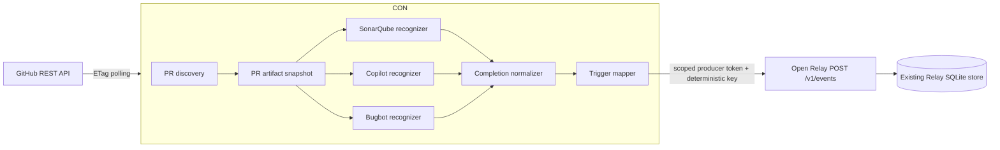

# GitHub PR Automation Connectors Design

**Status:** Approved design awaiting written-spec review  
**Parent architecture:** `docs/superpowers/specs/2026-09-05-open-relay-design.md`

## Goal

Add a local GitHub connector to Open Relay that detects completed SonarQube analysis, GitHub Copilot review, and Cursor Bugbot review artifacts on pull requests, normalizes them into one stable payload, and emits a configured Open Relay event.

The connector runs beside the loopback-only relay and polls GitHub REST. It does not expose a public webhook endpoint.

## Terminology

- **Connector:** owns authentication, polling, pagination, conditional requests, rate-limit handling, and Relay emission for one external system. Initial connector: `github`.
- **Recognizer:** a pure provider-specific matcher that turns GitHub PR artifacts into normalized completion candidates. Initial recognizers: `sonarqube`, `copilot-review`, and `cursor-bugbot`.
- **Trigger:** local configuration mapping one recognizer and identity policy to an Open Relay event type/version.
- **Completion:** proof that GitHub stored a terminal provider artifact. Completion is distinct from a successful or clean result.

“Extension” remains the term for Open Relay event definitions and handlers. Connectors are event producers, not handler extensions.

## Scope

### Included

- Foreground command `relay connect github --config <path>`.
- One-shot reconciliation command `relay connect github --config <path> --once`.
- GitHub.com and configurable GitHub Enterprise REST base URL.
- Recently updated open and closed pull requests.
- Conditional REST polling with in-memory ETags.
- GitHub rate-limit and transient-failure handling.
- Built-in SonarQube, Copilot, and Cursor Bugbot recognizers.
- Stable normalized completion payload.
- Deterministic Relay idempotency keys.
- Stable Relay producer identity per repository.
- Current-head-only emission.

### Excluded

- Public GitHub webhook receiver.
- Hosted GitHub App service.
- Tunnel management.
- Generic JSONPath/rules-engine recognition.
- Provider-specific output event schemas.
- Waiting for all providers and emitting an aggregate “all complete” event.
- Triggering SonarQube, Copilot, or Bugbot runs.
- Copilot or Bugbot comment-body ingestion.
- Source-code ingestion.
- Timeout-as-failure events.
- Lifecycle events for review edits, dismissal, or deleted comments.
- Sonar Compute Engine API polling in the initial connector.

## Architecture



The connector is a separate Node process. It reads the GitHub token from its environment, obtains scoped Relay producer credentials through the local admin runtime credential, polls GitHub, and emits through the existing HTTP API.

The connector has no durable database. GitHub retains source artifacts; Open Relay retains emission identity. In-memory ETags reduce requests while running. Restart performs a full bounded reconciliation and safely replays deterministic emissions.

## Command contract

```text
relay start
relay connect github --config .relay/connectors/github.json
relay connect github --config .relay/connectors/github.json --once
relay connect github --config .relay/connectors/github.json --once --discover
```

`connect github` requires a running local relay. It exits nonzero for invalid configuration, missing GitHub token, invalid Relay runtime credentials, or GitHub authentication failure. In continuous mode it remains foreground and shuts down on `SIGINT`/`SIGTERM` after its active request settles or aborts.

`--once` performs one complete lookback reconciliation, emits all newly recognized completions idempotently, prints a JSON summary without credentials, and exits.

`--discover` lists observed check names, app IDs/slugs, and review bot identities for the bounded lookback. It never emits. In discovery mode only, Sonar triggers may omit pinned app identity so the operator can learn what to configure.

## Configuration

Default path: `.relay/connectors/github.json`.

```json
{
  "connector": "github",
  "apiBaseUrl": "https://api.github.com",
  "apiVersion": "2026-03-10",
  "tokenEnv": "GITHUB_TOKEN",
  "pollIntervalMs": 15000,
  "lookbackHours": 24,
  "repositories": ["owner/repository"],
  "triggers": [
    {
      "id": "sonarqube-completed-v1",
      "recognizer": "sonarqube",
      "match": {
        "checkNames": ["SonarCloud Code Analysis", "SonarQube Code Analysis"],
        "appIds": [123456]
      },
      "emit": {
        "type": "pr.automation.completed",
        "version": 1
      }
    },
    {
      "id": "copilot-review-completed-v1",
      "recognizer": "copilot-review",
      "match": {
        "userIds": [175728472],
        "appUrls": ["https://github.com/apps/copilot-pull-request-reviewer"],
        "logins": ["copilot-pull-request-reviewer[bot]"]
      },
      "emit": {
        "type": "pr.automation.completed",
        "version": 1
      }
    },
    {
      "id": "cursor-bugbot-completed-v1",
      "recognizer": "cursor-bugbot",
      "match": {
        "checkNames": ["Cursor Bugbot"],
        "appIds": [1210556],
        "appSlugs": ["cursor"]
      },
      "emit": {
        "type": "pr.automation.completed",
        "version": 1
      }
    }
  ]
}
```

### Validation rules

- `connector` must equal `github`.
- `apiBaseUrl` must use HTTPS, except explicit loopback addresses in tests.
- `tokenEnv` names an environment variable; the token value is never accepted in configuration.
- `pollIntervalMs` is an integer from 5,000 through 3,600,000.
- `lookbackHours` is an integer from 1 through 720.
- Repository values match GitHub `owner/name` syntax and contain no URL/path traversal.
- Trigger IDs are unique and match `[a-z0-9][a-z0-9._-]{0,127}`.
- Recognizers are one of the three built-ins.
- Emitted type/version must identify an event definition accepted by the running relay; an unknown definition is a surfaced connector error.
- Changing recognizer identity or emitted event semantics requires changing the trigger ID. Reusing an ID with changed payload/type causes a Relay idempotency conflict by design.

### Identity requirements

- SonarQube requires exact check name plus at least one configured `appId` or `appSlug`. SonarSource does not document a universal GitHub App identity; the operator must pin the identity observed in that repository. Name-only discovery may be displayed by `--once --discover`, but discovery never emits.
- Copilot requires `user.type === "Bot"` and at least one configured identity factor matching. The numeric user ID and app URL above are current official API observations; they remain overrideable because GitHub’s Copilot documentation contracts the request slug, not the review payload login.
- Cursor Bugbot requires exact check name and matching Cursor app ID or slug. The app ID/slug above are current public GitHub App metadata. The shared Cursor app identity alone is insufficient because it powers other Cursor features.

## GitHub authentication and permissions

The connector reads the token named by `tokenEnv`. It sends:

```text
Authorization: Bearer <token>
Accept: application/vnd.github+json
X-GitHub-Api-Version: <apiVersion>
User-Agent: open-relay-github-connector
```

Required repository permissions:

- Checks: read.
- Pull requests: read.
- Metadata: read.

No write permission is required because this connector observes but does not request reviews or mutate PRs.

The connector token never enters URLs, Relay events, connector configuration, diagnostics, or logs.

## Relay producer identity

For each configured repository, the connector obtains a producer credential from the local Relay using the admin runtime credential:

```text
scope: producer
subjectId: connector:github:<repository-id>
```

The issued token is process-local and may change after restart. The producer subject remains stable, preserving Relay acceptance identity.

The connector does not use one producer identity across repositories. Repository-scoped identity prevents an artifact ID collision or trigger mistake in one repository from affecting another.

## Polling algorithm

### PR discovery

For each repository, discover two sets:

```text
GET /repos/{owner}/{repo}/pulls
  ?state=open
  &per_page=100

GET /repos/{owner}/{repo}/pulls
  ?state=closed
  &sort=updated
  &direction=desc
  &per_page=100
```

Paginate every open PR regardless of age. Paginate closed/merged PRs until `updated_at` is older than `now - lookbackHours`. This avoids dropping an old open PR whose check finishes without changing the PR’s own `updated_at`.

Apply `If-None-Match` per URL. A `304` reuses the cached response body; it does **not** skip artifact polling, because a check run can complete without changing the pull-request list ETag.

### PR snapshot

For every changed/recent PR:

1. Read repository ID, full name, PR number, HTML URL, head SHA, base ref, state, and updated time.
2. If any configured recognizer requires check runs, request:

```text
GET /repos/{owner}/{repo}/commits/{headSha}/check-runs
  ?status=completed
  &filter=all
  &per_page=100
```

3. If Copilot is configured, request:

```text
GET /repos/{owner}/{repo}/pulls/{number}/reviews?per_page=100
```

4. Paginate both artifact collections completely.
5. Run the three pure recognizers over the immutable snapshot.
6. When candidates exist, re-fetch the PR. Emit only candidates whose artifact SHA still equals the current head SHA.

Check-run data is fetched once per PR and shared by SonarQube and Bugbot recognizers.

### Scheduling

- Repositories are processed independently.
- Request concurrency is fixed at four to avoid speculative scheduler configuration.
- Continuous mode sleeps `pollIntervalMs` between completed cycles.
- Only one cycle runs at a time; a slow cycle does not overlap itself.
- Shutdown aborts current GitHub and Relay requests.

## Recognizer contract

```ts
interface PrSnapshot {
  repository: {
    id: number;
    fullName: string;
  };
  pullRequest: {
    number: number;
    url: string;
    headSha: string;
    baseRef: string;
    updatedAt: string;
  };
  checkRuns: readonly GitHubCheckRun[];
  reviews: readonly GitHubPullRequestReview[];
}

interface CompletionCandidate {
  provider: string;
  triggerId: string;
  repositoryId: number;
  pullRequestNumber: number;
  artifactKind: "check_run" | "pull_request_review";
  artifactId: string;
  artifactHeadSha: string;
  payload: PrAutomationCompleted;
}

interface Recognizer {
  readonly id: "sonarqube" | "copilot-review" | "cursor-bugbot";
  recognize(snapshot: PrSnapshot, trigger: TriggerConfig): readonly CompletionCandidate[];
}
```

Recognizers are pure. They perform no I/O, retain no state, and never emit directly. A malformed artifact is ignored with a bounded diagnostic rather than crashing the poll cycle.

## SonarQube recognizer

A candidate requires:

```text
check_run.status == "completed"
check_run.name in trigger.match.checkNames
check_run.app.id in appIds OR check_run.app.slug in appSlugs
check_run.head_sha == snapshot.pullRequest.headSha
check_run.pull_requests contains this PR when that array is non-empty
check_run.id is a positive integer
check_run.completed_at is present
```

Supported documented names:

- `SonarCloud Code Analysis`
- `SonarQube Code Analysis`

The normalized `conclusion` preserves GitHub’s raw check conclusion. The connector does not label scanner execution, Compute Engine completion, or Quality Gate status separately because the GitHub check contract does not expose Sonar’s authoritative task/gate split.

A future `sonarqube-direct` connector may consume Sonar’s signed analysis-completion webhook or Compute Engine API for authoritative `taskId`, task status, revision, and Quality Gate status. That is a separate connector because its authentication and completion contract differ from GitHub polling.

## Copilot review recognizer

A candidate requires:

```text
review.submitted_at is present
review.commit_id == snapshot.pullRequest.headSha
review.user.type == "Bot"
review identity matches configured userIds, appUrls, or normalized logins
review.id is a positive integer
review.html_url is present
```

The artifact completion is `submitted`. The normalized conclusion is also `submitted`; the current review `state` is not used as the normalized conclusion because it can later be dismissed or edited.

The connector does not parse the review body. A submitted review whose body reports a Copilot internal error still emits a submitted completion, not a successful review. Consumers that require diagnostic classification need a future payload version with an explicitly non-contractual diagnostic field.

Inline review comments do not signal completion and are not fetched in v1. `review.id` remains the authoritative attempt identity.

## Cursor Bugbot recognizer

A candidate requires:

```text
check_run.status == "completed"
check_run.name == "Cursor Bugbot"
check_run.app.id in appIds OR check_run.app.slug in appSlugs
check_run.head_sha == snapshot.pullRequest.headSha
check_run.pull_requests contains this PR when that array is non-empty
check_run.id is a positive integer
check_run.completed_at is present
```

The exact check name excludes `Cursor Bugbot Autofix`.

The raw conclusion is preserved:

- `success`: no issues and no unresolved earlier Bugbot comments.
- `neutral`: findings, supersession/cancellation, or internal error.
- `failure`: findings when fail-on-unresolved is configured.

The connector never treats `neutral` as clean or successful.

## Normalized completion payload

```ts
interface PrAutomationCompleted {
  schemaVersion: 1;
  provider: string;
  repository: {
    id: number;
    fullName: string;
  };
  pullRequest: {
    number: number;
    url: string;
    headSha: string;
    baseRef: string;
  };
  artifact: {
    kind: "check_run" | "pull_request_review";
    id: string;
    name: string;
    completion: "completed" | "submitted";
    conclusion: string | null;
    completedAt: string;
    detailsUrl: string | null;
  };
}
```

Only provider-origin timestamps enter the payload. Connector observation time is excluded because it changes across reconciliation runs.

Mutable review bodies, comments, current-head flags, PR state, and provider summaries are excluded. This keeps the payload stable for a given artifact ID and prevents Relay idempotency conflicts after restart.

## Trigger mapping and emission

Each candidate maps through its trigger:

```text
Open Relay event type: trigger.emit.type
Open Relay event version: trigger.emit.version
Open Relay payload: normalized PrAutomationCompleted
```

Deterministic idempotency key:

```text
github:<repository-id>:<trigger-id>:<artifact-kind>:<artifact-id>
```

The connector calls existing Open Relay `POST /v1/events` using its repository-scoped producer credential.

Relay outcomes:

- New key and payload: a new event is accepted.
- Same key and identical type/version/payload: existing event is returned; connector records a harmless replay.
- Same key with changed type/version/payload: `idempotency_conflict`; connector marks the trigger invalid and continues other triggers/repositories.
- Unknown event definition: connector marks the emitted type/version invalid and continues polling without discarding the GitHub artifact.

No local “seen” table is necessary.

## Staleness and reruns

Every check run or submitted review is an individual attempt. New pushes normally produce new artifact IDs and therefore new Relay events.

Before emitting a candidate, the connector re-fetches the PR and requires:

```text
candidate.artifactHeadSha == current pull_request.head.sha
```

A stale candidate is ignored. It is not emitted with a mutable `isCurrentHead` flag.

If the PR head changes immediately after the final verification request, the emitted payload still carries the exact analyzed SHA. Downstream handlers must use that SHA rather than assuming it is perpetually current.

## Rate limits and errors

### GitHub responses

- `200`: validate and process response.
- `304`: reuse in-memory cached response.
- `401`: stop the connector; the token is invalid.
- `403` with `Retry-After`: sleep for that duration plus bounded jitter.
- `403` with exhausted `X-RateLimit-Remaining`: sleep until `X-RateLimit-Reset` plus bounded jitter.
- `404`: mark that repository invalid for the current process; continue other repositories.
- `429`: honor `Retry-After`.
- `5xx` or network error: exponential backoff from `pollIntervalMs` up to `pollIntervalMs × 8`.

A successful request resets transient backoff for that repository.

### Relay responses

- Relay unavailable: retry recognized candidates on the next cycle; deterministic keys prevent duplicates.
- Invalid local runtime/admin credential: stop connector and require Relay restart/reconnect.
- Unknown emitted event definition: surface trigger configuration error; keep processing other triggers.
- Idempotency conflict: surface trigger drift; disable that trigger for the process lifetime.

### Recognition errors

One malformed GitHub artifact or recognizer exception is isolated to that artifact/recognizer. It must not stop other recognizers or repositories.

Absence of a completion artifact is `unknown/pending`. The connector emits no timeout, failure, or synthetic success event.

## Security

- GitHub token comes from environment only.
- Relay admin token is read from the mode-`0600` local runtime file only long enough to issue repository-scoped producer credentials.
- GitHub and Relay tokens are redacted recursively from errors and logs.
- No token appears in URL query strings.
- API base is HTTPS except loopback test fixtures.
- Repository and trigger configuration are treated as trusted local configuration; GitHub responses remain untrusted and schema-checked.
- Event payload excludes source, comments, review bodies, and provider logs.
- The connector requests read permissions only.
- Connector shutdown aborts in-flight requests and clears token references from long-lived state where practical.

## Operability

Structured logs contain:

```text
connector=github
repository.id
repository.fullName
pullRequest.number
pullRequest.headSha
recognizer
triggerId
artifact.kind
artifact.id
result=recognized|stale|emitted|replayed|ignored|error
```

Tokens, headers, comment bodies, source text, and full provider payloads are never logged.

`--once` summary:

```json
{
  "repositories": 1,
  "pullRequests": 4,
  "candidates": 3,
  "emitted": 2,
  "replayed": 1,
  "stale": 0,
  "errors": []
}
```

## Verification strategy

### Configuration

- Reject embedded tokens, non-HTTPS API bases, invalid repository names, duplicate trigger IDs, unknown recognizers, invalid event versions, and unpinned Sonar identity outside `--discover`.

### GitHub client

- Paginate PR, check-run, and review endpoints through `Link` headers.
- Cache response bodies with ETags; PR-list `304` still polls artifacts, while artifact `304` safely reuses its cached body.
- Respect `Retry-After` and primary rate-limit reset.
- Isolate repository failures.
- Abort cleanly on shutdown.
- Never expose the GitHub token in URLs/errors/logs.

### Recognizers

- SonarCloud and SonarQube names match only with pinned app identity.
- Sonar pending/in-progress checks do not emit.
- Sonar same-name wrong-app checks do not emit.
- Copilot requires submitted timestamp, current commit, bot type, and configured identity.
- Copilot request state and inline comments do not emit.
- Copilot submitted error-body review still normalizes as `submitted`.
- Bugbot exact check and Cursor app identity emit.
- Bugbot Autofix and wrong-app checks do not emit.
- Bugbot `neutral` remains neutral.

### Reconciliation and Relay

- Repeated polling of one artifact produces one Relay event.
- Connector restart with empty in-memory state produces harmless replays.
- Trigger ID change permits a new interpretation; unchanged ID with changed payload surfaces conflict.
- Head change between snapshot and final PR read suppresses candidate.
- Recently closed PR remains discoverable inside lookback.
- Relay outage followed by recovery eventually emits once.
- One recognizer failure does not block siblings.
- Fake GitHub API plus real Open Relay acceptance verifies end-to-end behavior.

## Source evidence

### GitHub platform

- [GitHub check run webhook/API semantics](https://docs.github.com/en/rest/checks/runs)
- [GitHub pull-request review API](https://docs.github.com/en/rest/pulls/reviews)
- [GitHub webhook event payloads](https://docs.github.com/en/webhooks/webhook-events-and-payloads)
- [GitHub webhook ordering guidance](https://docs.github.com/en/webhooks/testing-and-troubleshooting-webhooks/troubleshooting-webhooks)

### SonarQube

- [SonarQube Cloud pull-request analysis](https://docs.sonarsource.com/sonarqube-cloud/analyzing-source-code/pull-request-analysis/)
- [SonarQube Cloud GitHub integration](https://docs.sonarsource.com/sonarqube-cloud/managing-your-projects/administering-your-projects/devops-platform-integration/github/)
- [SonarQube Cloud webhooks](https://docs.sonarsource.com/sonarqube-cloud/discovering-sonarcloud/integrations/webhooks/)
- [SonarQube Server pull-request analysis](https://docs.sonarsource.com/sonarqube-server/2026.1/analyzing-source-code/setting-up-the-pull-request-analysis/)
- [SonarQube Server GitHub binding](https://docs.sonarsource.com/sonarqube-server/2026.1/project-administration/creating-project/github/configure-binding/)

### Copilot

- [Request a Copilot code review](https://docs.github.com/en/copilot/how-tos/use-copilot-agents/request-a-code-review/use-code-review)
- [Configure automatic Copilot review](https://docs.github.com/en/copilot/how-tos/copilot-on-github/set-up-copilot/configure-code-review)
- [Copilot code-review concepts and triggers](https://docs.github.com/en/copilot/concepts/agents/code-review)

### Cursor Bugbot

- [Cursor Bugbot documentation](https://cursor.com/docs/bugbot)
- [Cursor GitHub integration](https://cursor.com/docs/integrations/github)
- [Current public Cursor GitHub App metadata](https://api.github.com/apps/cursor)

## Locked decisions

- The feature is named the GitHub connector; provider logic is named recognizers; mappings are triggers.
- Initial deployment is a separate local polling process.
- One normalized completion event shape serves all providers.
- Completion emits once per provider artifact, not after all providers aggregate.
- Open Relay’s deterministic idempotency is the durable seen-set.
- Sonar GitHub checks require operator-pinned app identity.
- No provider comment or body text enters the normalized payload.
- Current-head verification happens immediately before emission.
